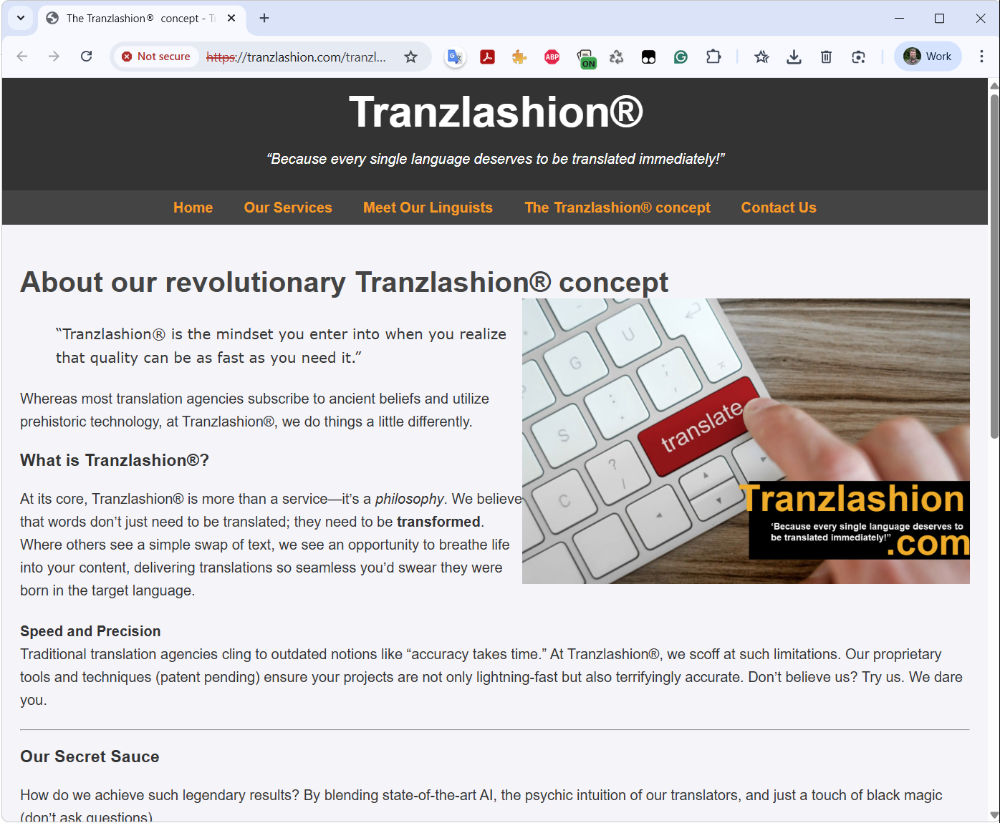

I created [tranzlashion.com](https://tranzlashion.com) as a parody of the cheap, dodgy translation agencies that seem to pop up everywhere online.

You know the type: flashy websites promising "lightning speed" translations at rock-bottom prices, vague claims about "quality", stock photos of people pointing at keyboards, and a suspicious overuse of the  symbol.

## The Tranzlashion Concept

*"Tranzlashion is the mindset you enter into when you realize that quality can be as fast as you need it."*

At its core, Tranzlashion is more than a serviceit's a *philosophy*. We believe that words don't just need to be translated; they need to be **transformed**. Where others see a simple swap of text, we see an opportunity to breathe life into your content, delivering translations so seamless you'd swear they were born in the target language.

Whereas most translation agencies subscribe to ancient beliefs and utilize prehistoric technology, at Tranzlashion, we do things a little differently.

## Speed and Precision

Traditional translation agencies cling to outdated notions like "accuracy takes time." At Tranzlashion, we scoff at such limitations. Our proprietary tools and techniques (patent pending) ensure your projects are not only lightning-fast but also terrifyingly accurate. Don't believe us? Try us. We dare you.

## Our Secret Sauce

How do we achieve such legendary results? By blending state-of-the-art AI, the psychic intuition of our translators, and just a touch of black magic (don't ask questions).

The site features all the hallmarks of a questionable LSP:

- **Meaningless slogans**  "Because every single language deserves to be translated immediately!"
- **Impossible promises**  Get a free quote in "light speed"!
- **Vague buzzwords**  We will "take you by the hand and guide you to grow your language needs into the future!"
- **The customer is always right**  "We will assure you and/or your multiple clients and customers who is the boss of quality. Yes, that's right: **you are**."
- **Proprietary magic**  "patent pending" tools and "psychic intuition"

## Why I made it

After 30 years in the translation industry, I've seen countless agencies come and go. Many of them share a similar aesthetic: cheap templates, stock imagery, buzzword-heavy copy, and promises that would make any professional translator wince.

I thought it would be fun to create an over-the-top parody that captures the essence of these sites. It's meant as gentle industry humour  a knowing wink to fellow translators who've received "exciting opportunities" from such companies offering rates that wouldn't cover a cup of coffee.

Check it out at [tranzlashion.com](https://tranzlashion.com) and see if you can spot all the red flags!

*Disclaimer: Tranzlashion is not a real company. Please do not actually request translations. If you need quality DutchEnglish translation, you know where to find me.*